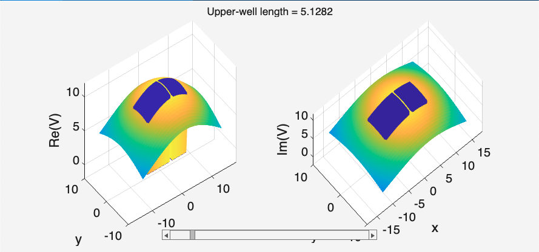
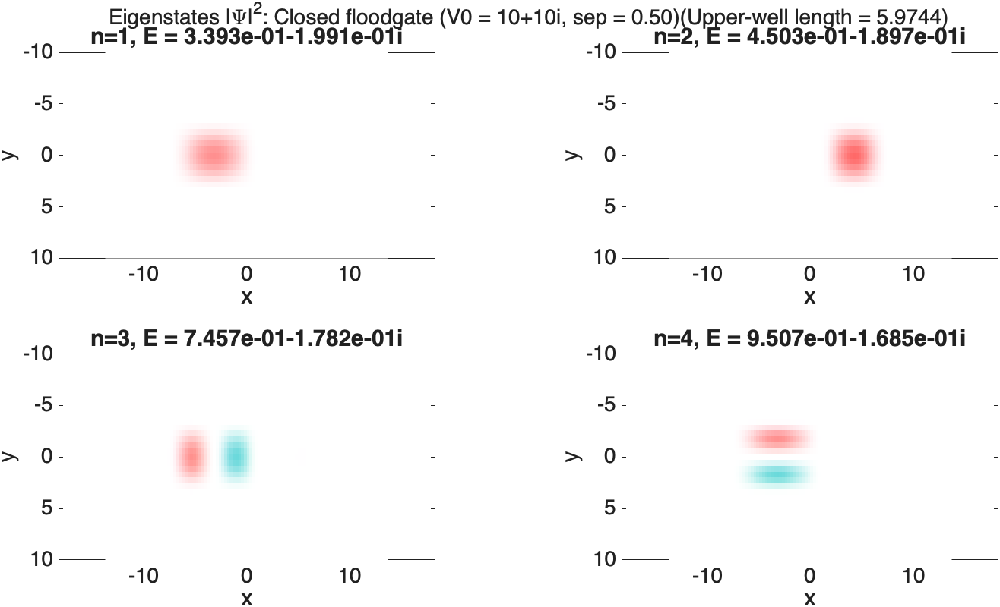
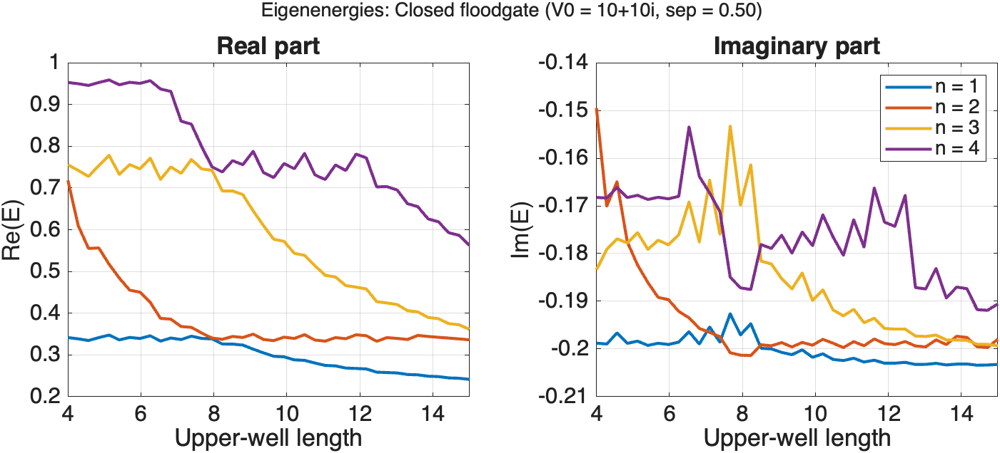
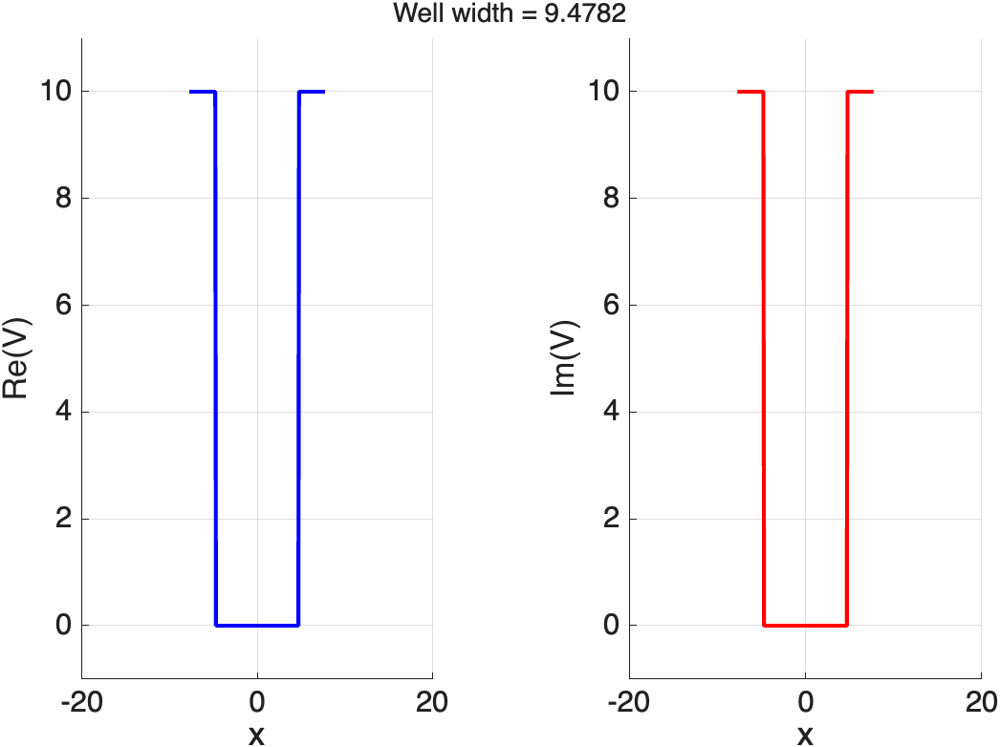
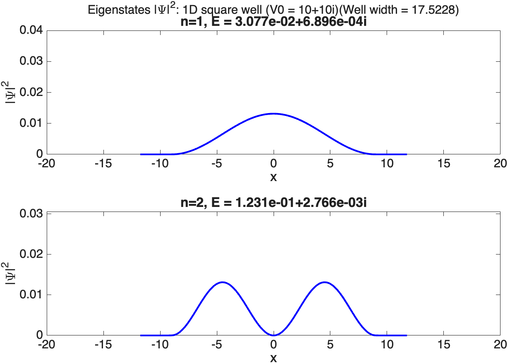
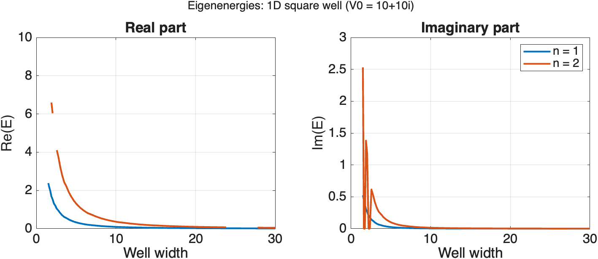
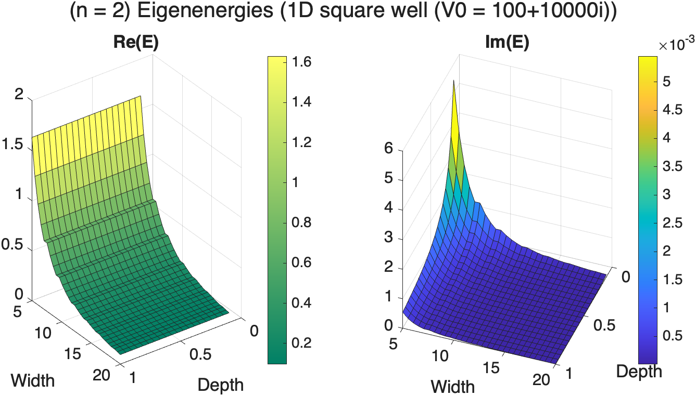

# Time-Independent Schrodinger Equation in a non-Hermitian potential
> Tools & demos for solving and visualising eigenstates of the 1D/2D TISE 
> in various complex-valued (i.e. non-Hermitian) potentials.

This repo includes the following functions/tools:
- Generate profile 'masks' for several different shapes of potential (`dmd-potentials/`)
- Modulate these intensity profiles with local smoothing and/or a global Gaussian intensity profile
- Solve a set of potentials for the lowest several eigenstates. This is designed to make parameter-scans easy.
- Visualise a series of potentials or eigenstates, with an interactive slider to scan through a control parameter.
- Plot a 1D or 2D energy surface obtained by scanning through one or two parameters.
- Instructions for saving and loading data.

The TISE is solved as the eigenproblem of a finite-sized Hamiltonian on a discretised spatial grid.
The functions above have been designed to work with both 1D and 2D grids.
`simulations.m` contains demos of one-parameter and two-parameter scans, both with
fixed spatial coordinates and with variable spatial coordinates. The latter is
useful if the control parameter changes the relevant spatial scale. Most of the included mask profiles
are demo'd at some point.

## Examples

#### 2D potentials

#### 2D eigenstate visualisation:
Colour is phase, saturation is amplitude.

#### Corresponding eigenenergies

#### 1D square-well

#### Corresponding 1D eigenstates

#### One-parameter energy scan

#### Two-parameter energy scan

## License
MIT.

## Credit
I am grateful to others for the following helpful functions:
- `RGB2Th`. Kanghyun Chu (2019). [IMAGECF Complex Field Visualization (amplitude, phase)](https://www.mathworks.com/matlabcentral/fileexchange/69930-imagecf-complex-field-visualization-amplitude-phase), MATLAB Central File Exchange.
- `fourdif.m`. J.A.C Weideman (2003). [DMSUITE](https://www.mathworks.com/matlabcentral/fileexchange/29-dmsuite), MATLAB Central File Exchange.
- `subaxis/`. Aslak Grinsted (2014). [Subaxis - Subplot](https://www.mathworks.com/matlabcentral/fileexchange/3696-subaxis-subplot), MATLAB Central File Exchange.

